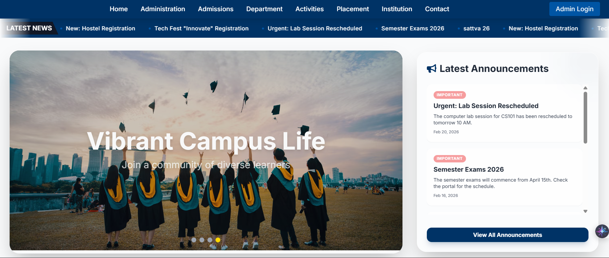
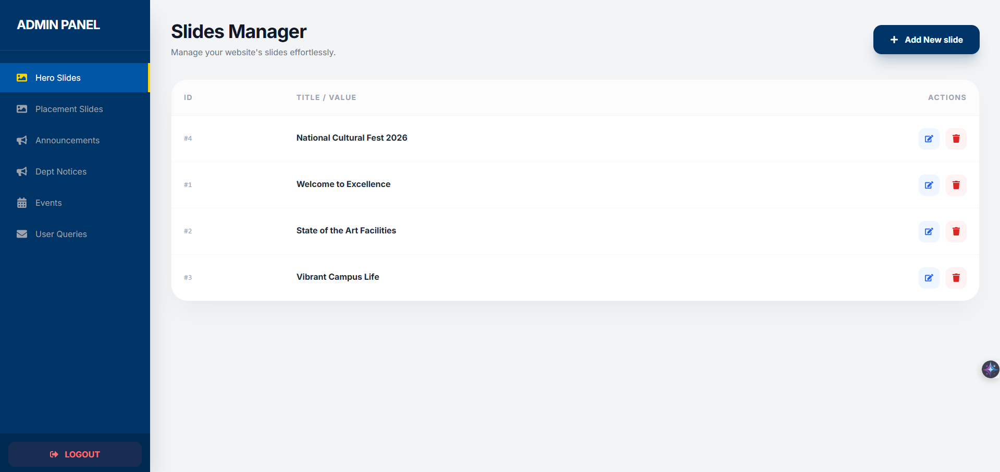
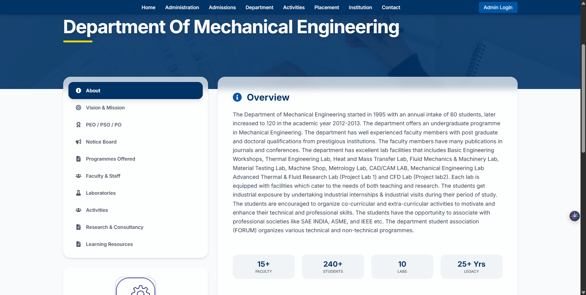
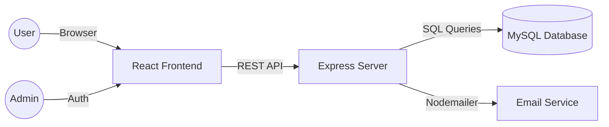

#  Institutional Portal & Custom CMS


A high-performance, full-stack institutional web portal designed to centralize college administration, department updates, and student communication. The platform features a customized Content Management System (CMS) allowing administrators to manage real-time data without code intervention.

---

## Screenshots
| Home Page | Admin Dashboard | Department Notices |
| :---: | :---: | :---: |
|  |  |  |


---

## Key Features

### Custom CMS (Content Management System)
- **Dynamic Content**: Full control over hero sliders, announcement tickers, and upcoming event grids.
- **Departmental Isolation**: Secure, dedicated notice boards for various departments.
- **Role-Based Updates**: Admin dashboard for non-technical staff to update information instantly.

### Security & Authentication
- **Secure Access**: Protected admin routes using **JSON Web Tokens (JWT)**.
- **Data Protection**: Industry-standard password hashing using **Bcrypt**.
- **Input Validation**: Sanitized API endpoints to prevent SQL injection and XSS.

### Automated Communication
- **Integrated Contact Service**: Built-in query portal for students/visitors.
- **Direct Reply System**: Integrated mailing service (Nodemailer) allowing admins to respond to queries directly from the dashboard.

---

## System Architecture



---

## Tech Stack & Tools

- **Frontend**: React.js, Tailwind CSS, Framer Motion (Animations), Axios.
- **Backend**: Node.js, Express.js.
- **Database**: MySQL (Relational Schema Design).
- **Authentication**: JWT, HttpsOnly Cookies/Local Storage.
- **Version Control**: Git & GitHub.

---

## Installation & Setup

1. **Clone the repository**:
   ```bash
   git clone https://github.com/mohammedshibiltech/Dynamic-Institutional-Web-Portal-CMS-
   ```

2. **Backend Setup**:
   ```bash
   cd server
   npm install
   # Configure your .env file with DB_USER, DB_PASSWORD, JWT_SECRET
   npm run dev
   ```

3. **Frontend Setup**:
   ```bash
   cd client
   npm install
   npm run dev
   ```

---

## Challenges Overcome
- **State Management**: Orchestrated real-time synchronization between the Admin CMS and the public-facing Home Page using complex React hooks.
- **Database Integrity**: Designed a relational schema to handle foreign key relationships between departments and their respective notice boards.
- **User UX**: Optimized the delivery of high-resolution images across the slider system for faster LCP (Largest Contentful Paint).

---

## License
Distributed under the MIT License. See `LICENSE` for more information.

---

**Developed with dedication by MOHAMMED SHIBIL, MILAN, PARVANA, GAYATHRI
```
www.linkedin.com/in/mohdshibilp
```
