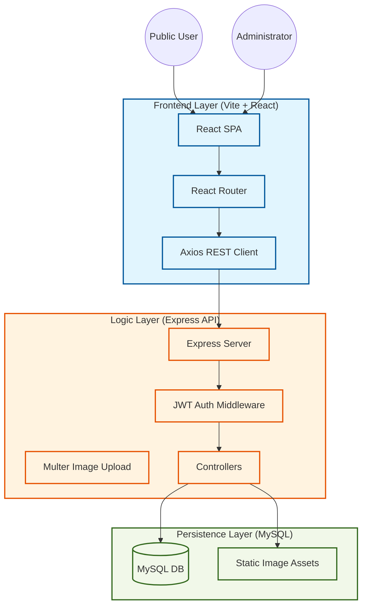
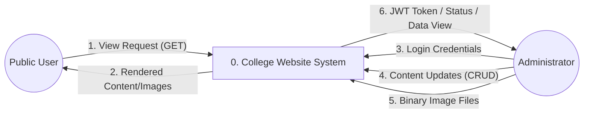
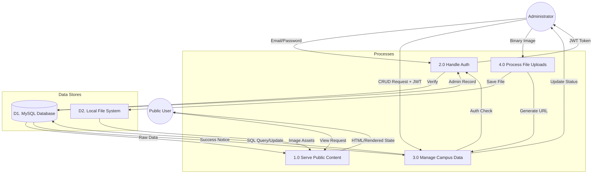
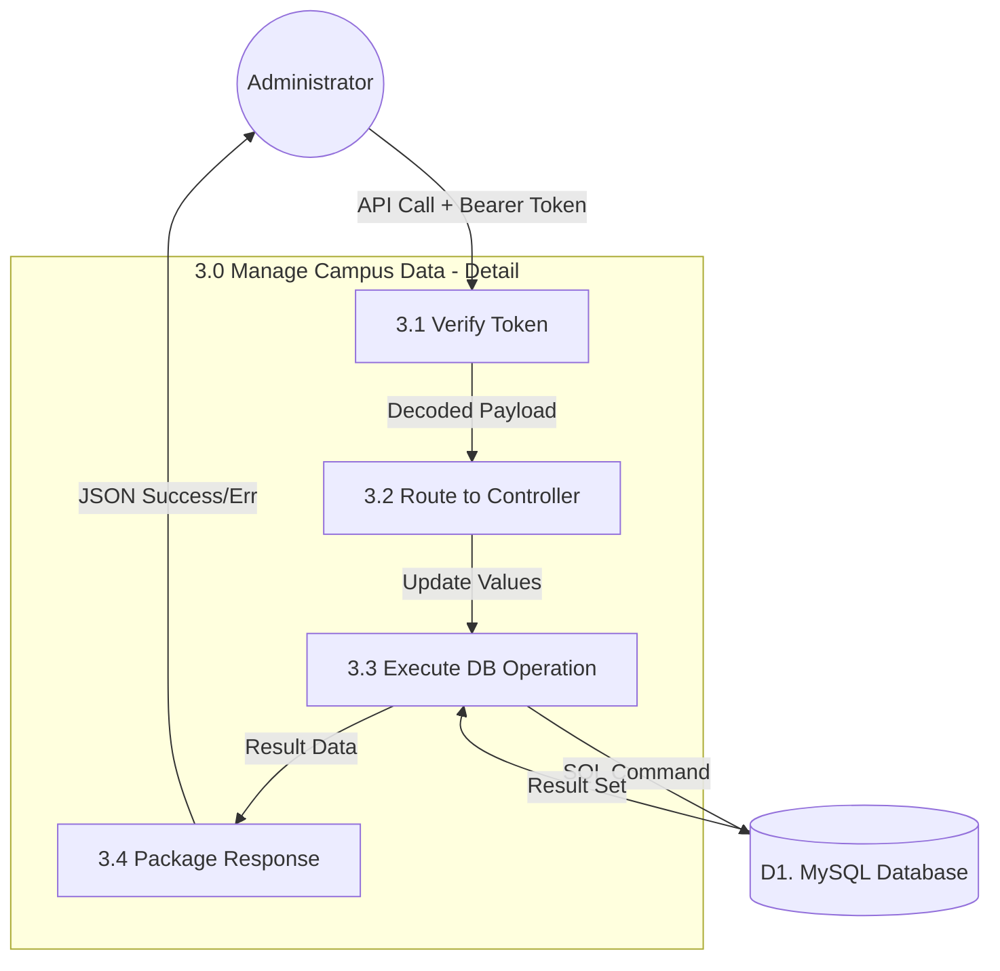
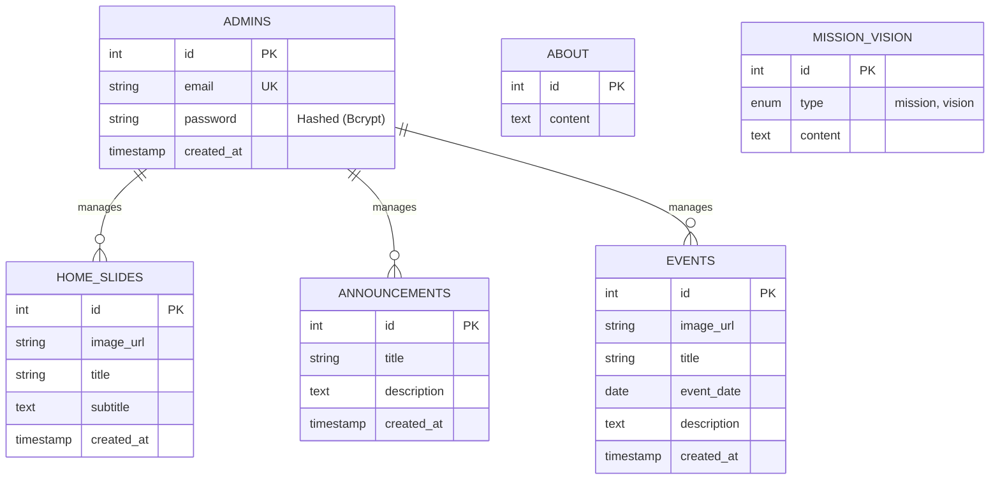
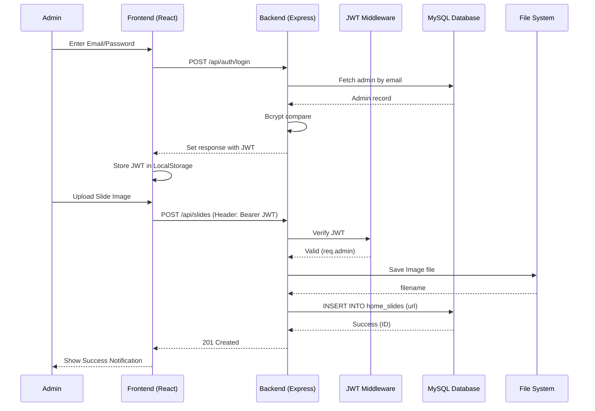

# Technical Architecture Master Documentation

This document provides a deep-dive into the technical structure, data flows, and architectural patterns of the college website.

---

## 1. System Context & Architecture
The system follows a modern decoupled architecture with a **React** single-page application (SPA), a **Node.js/Express** RESTful API, and a **MySQL** relational database.

---

## 2. Data Flow Diagrams (DFD)

### Level 0: Context Diagram
The system as a single process, showing external entities and high-level data interfaces.

---

### Level 1: Functional DFD
Decomposing the system into major processes, showing interactions with data stores.

---

### Level 2: Detailed Process (Admin Content Management)
A granular view of the interaction between the API Controllers, Middleware, and Storage.

---

## 3. Detailed Entity Relationship Diagram (ERD)
The logical database design supporting the application.

---

## 4. Sequence Diagram: Admin Auth & Slide Upload
Detailed interaction timeline for a common administrative task.

---

## 5. Summary of Technologies
- **Frontend**: Vite, React 18, Tailwind CSS (Styling), Axios (API Communication).
- **Backend**: Node.js, Express.js (REST API), Multer (File Upload), JsonWebToken (Auth).
- **Database**: MySQL 8.0, Bcrypt (Password Hashing).
