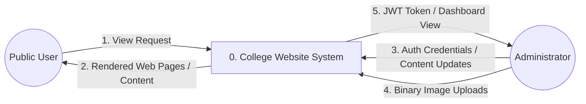
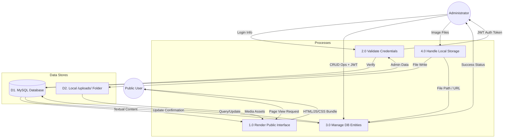
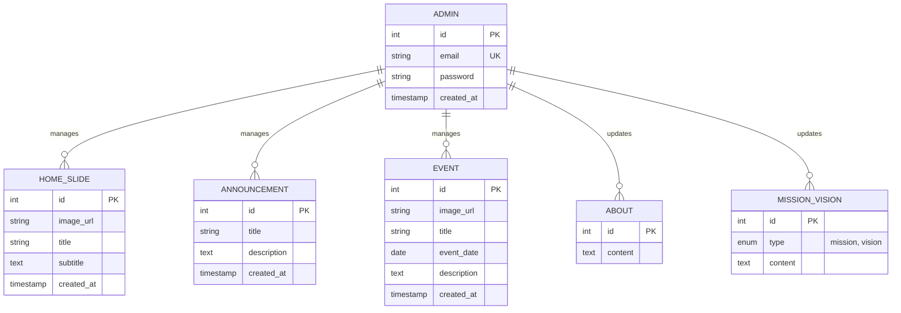

# Data Flow and ER Diagrams

This document focuses on the data-centric aspects of the website, illustrating how information moves through the system and how it is structured in the database.

## 1. Data Flow Diagram (DFD)

### Level 0: Context Diagram
The system as a single central process.

---

### Level 1: Functional Data Flow
Deepening the system to show major sub-processes and data stores.

---

## 2. Entity Relationship Diagram (ERD)
The logical structure of the database, showing entities, attributes, and relationships.

## Data Definitions

| Entity | Description | Key Attributes |
| :--- | :--- | :--- |
| **Admin** | Authorized users who can manage website content. | `email`, `password` |
| **Home Slide** | Images and text for the homepage hero carousel. | `image_url`, `title` |
| **Announcement** | Short updates or news alerts displayed on the home page. | `title`, `description` |
| **Event** | Calendar items with specific dates and descriptions. | `event_date`, `title` |
| **About/MV** | Static content sections representing college information. | `type`, `content` |
