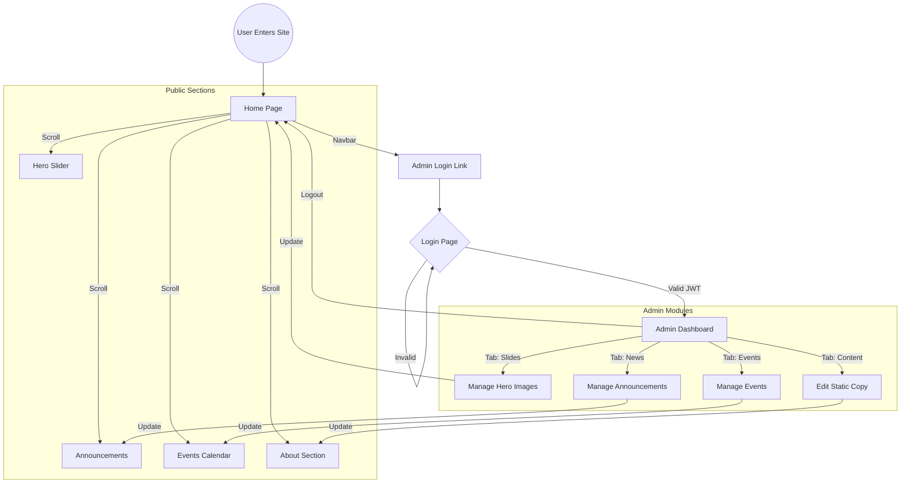

# Website Flowchart

This flowchart illustrates the navigation and logic paths for both public users and administrators.

## Flow Description

1.  **Entry**: Users land on the **Home Page**, which dynamically aggregates content from the database.
2.  **Public Navigation**: Users can browse the hero slider, read announcements, view the event calendar, and learn about the college.
3.  **Admin Access**: Administrators can access the login portal via the navbar. 
4.  **Authentication**: Access to the dashboard is strictly protected by **JWT authentication**.
5.  **Dynamic Updates**: Any changes made in the **Admin Dashboard** (Slides, Events, etc.) are immediately reflected on the public-facing home page sections.
