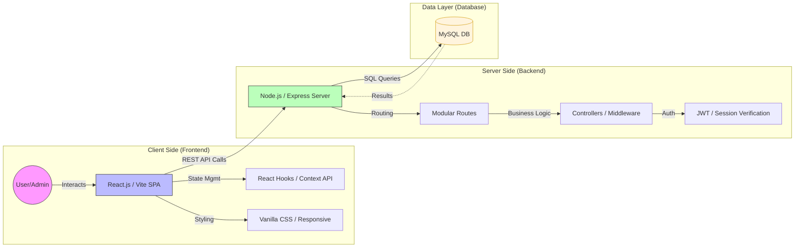
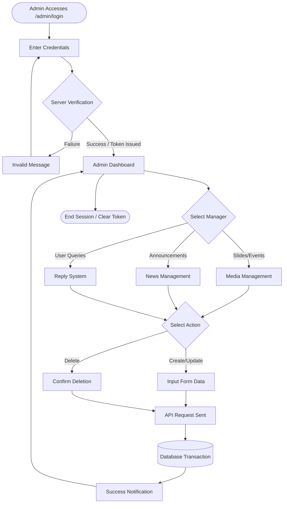
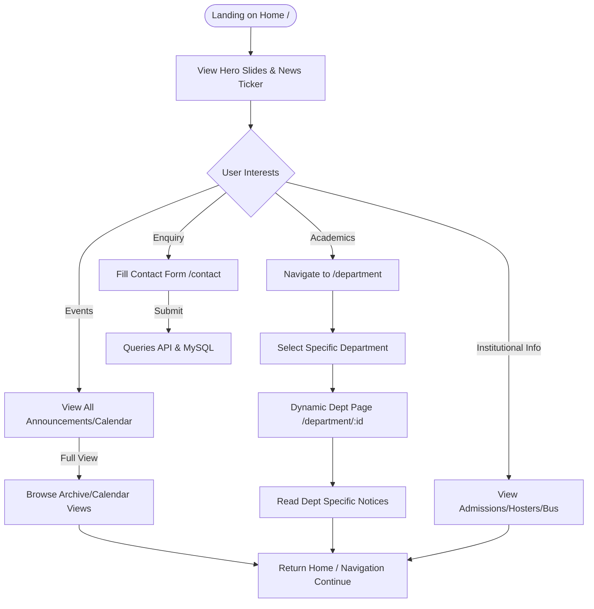

# Project Flowcharts & Architecture

This document contains visual representations of the project's architecture and module workflows using Mermaid diagrams.

---

## 1. System Design (High-Level Architecture)
This chart illustrates the 3-tier architecture of the college website project.

---

## 2. Admin Module Flow
This flow details the administrative lifecycle from authentication to content management.

---

## 3. User Module Flow
This chart tracks the public visitor journey through the institutional portal.

