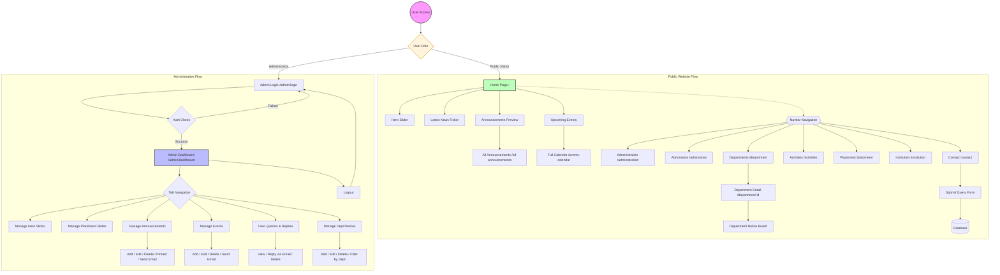

# Website User Flow Diagram

This document outlines the complete navigation and task flow for the College Engineering Adoor website. It is divided into **Public User Flow** and **Administrative Flow**.

## Complete User Flow (Mermaid)

---

## Flow Highlights

### 1. Public Navigation
- **Departmental Access**: Users can drill down from the main department list to specific department pages where notices are categorized.
- **Dynamic Updates**: Announcements and Events are synchronized across the Home page, dedicated lists, and the administrator's dashboard.
- **Engagement**: The Contact page allows direct communication with the administration via a query system.

### 2. Administrative Capabilities
- **Content Management**: Fine-grained control over sliders, news, and events.
- **Smart Notices**: Ability to mark specific announcements as "Important" to pin them or trigger system-wide emails.
- **Feedback Loop**: Integrated query management system allowing admins to reply directly to visitor inquiries via automated emails.
